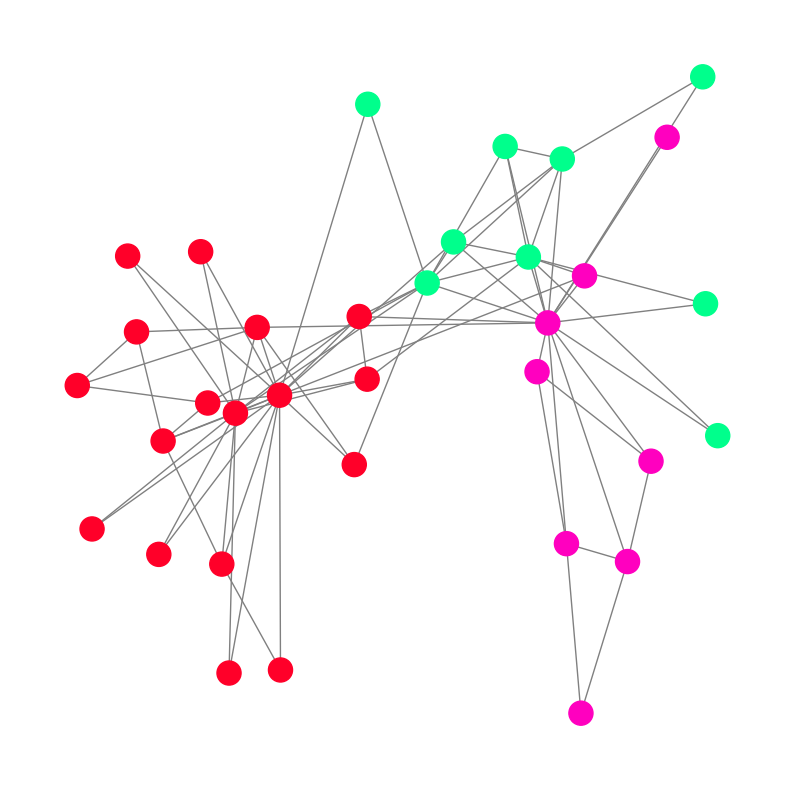

# Classical GNN Algorithms

This repository contains clean and minimal implementations of classical Graph Neural Network (GNN) algorithms. The goal is to provide an educational and practical foundation for understanding how fundamental GNN models work from scratch.

<table style="width: 100%; font-size: 20px; border-collapse: collapse; border: 1px solid #ddd;">
  <tr>
    <th style="padding: 10px; text-align: center; border: 1px solid #ddd; background-color: #f4f4f4; color: black;">Model</th>
    <th style="padding: 10px; text-align: center; border: 1px solid #ddd; background-color: #f4f4f4; color: black;">Video</th>
    <th style="padding: 10px; text-align: center; border: 1px solid #ddd; background-color: #f4f4f4; color: black;">Arxiv</th>
    <th style="padding: 10px; text-align: center; border: 1px solid #ddd; background-color: #f4f4f4; color: black;">Status</th>
  </tr>
  <tr>
    <td style="padding: 10px; text-align: center; border: 1px solid #ddd;">GCN</td>
    <td style="padding: 10px; text-align: center; border: 1px solid #ddd;"><a href="artifacts/videos/video_after_train_gcn.mp4">video</a></td>
    <td style="padding: 10px; text-align: center; border: 1px solid #ddd;"><a href="https://arxiv.org/pdf/1609.02907">paper</a></td>
    <td style="padding: 10px; text-align: center; border: 1px solid #ddd; color: #4CAF50; font-weight: bold; font-style: italic;">✔ Done</td>
  </tr>
  <tr>
    <td style="padding: 10px; text-align: center; border: 1px solid #ddd;">GAT</td>
    <td style="padding: 10px; text-align: center; border: 1px solid #ddd;">nan</td>
    <td style="padding: 10px; text-align: center; border: 1px solid #ddd;"><a href="https://arxiv.org/pdf/1905.01121">paper</a></td>
    <td style="padding: 10px; text-align: center; border: 1px solid #ddd; color: #FF9800; font-weight: bold; font-style: italic;">⏳ In Progress</td>
  </tr>
  <tr>
    <td style="padding: 10px; text-align: center; border: 1px solid #ddd;">GIN</td>
    <td style="padding: 10px; text-align: center; border: 1px solid #ddd;">nan</td>
    <td style="padding: 10px; text-align: center; border: 1px solid #ddd;"><a href="https://arxiv.org/pdf/1905.01121">paper</a></td>
    <td style="padding: 10px; text-align: center; border: 1px solid #ddd; color: #F44336; font-weight: bold; font-style: italic;">✖ Stopped</td>
  </tr>
  <tr>
    <td style="padding: 10px; text-align: center; border: 1px solid #ddd;">GraphSAGE</td>
    <td style="padding: 10px; text-align: center; border: 1px solid #ddd;">nan</td>
    <td style="padding: 10px; text-align: center; border: 1px solid #ddd;"><a href="https://arxiv.org/pdf/1706.02216">paper</a></td>
    <td style="padding: 10px; text-align: center; border: 1px solid #ddd; color: #F44336; font-weight: bold; font-style: italic;">✖ Stopped</td>
  </tr>
  <tr>
    <td style="padding: 10px; text-align: center; border: 1px solid #ddd;">Graphormer</td>
    <td style="padding: 10px; text-align: center; border: 1px solid #ddd;">nan</td>
    <td style="padding: 10px; text-align: center; border: 1px solid #ddd;"><a href="https://arxiv.org/pdf/2106.05234">paper</a></td>
    <td style="padding: 10px; text-align: center; border: 1px solid #ddd; color: #F44336; font-weight: bold; font-style: italic;">✖ Stopped</td>
  </tr>
</table>
